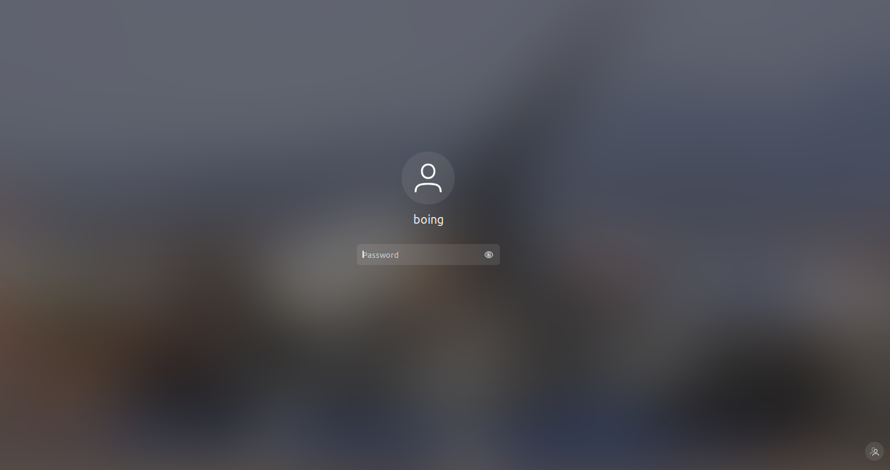
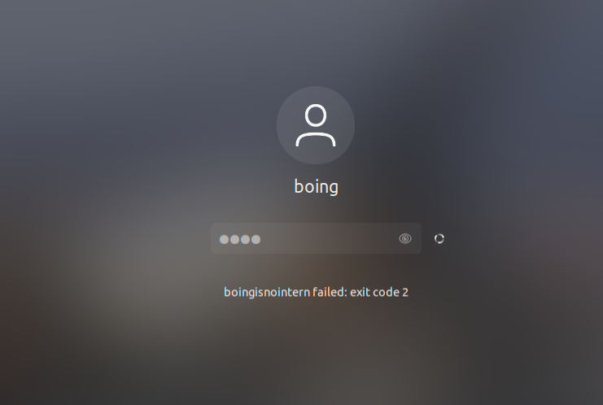
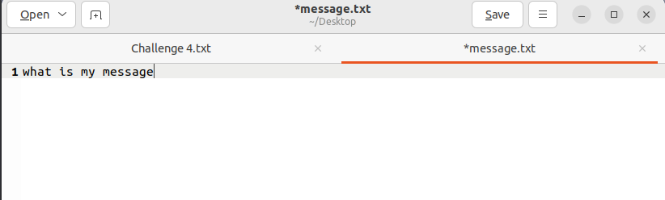
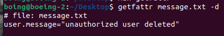

# lukshBoeingImagePracticeWriteup

This is the writeup for the Cyber Patriot practice image that you can access [here on google drive](https://drive.google.com/file/d/1j_f3m6KezvvLMhCdUWkW0h_tRAZ-sRtt/view).
Image creator: Luksh
Image: Ubtuntu (Boeing practice)
Difficulty: Easy

Below is the entire tutorial/writeup to complete this image. Try not to use this writeup unless you are entirely stuck (nothing should take more than 10+ minutes per forensic).

# Unlocking the image


When the image is initially loaded, it will be in a locked state. This is done on purpose and can easily be unlocked via attempting to enter anything in the password line.

`boingisnointern` _is_ the **password**. Use that to log into the system.

# Forensics

The entire system is a bunch of forensics.

## Challenge #1

```
What is the full path of the file that allowed you to see the password when you tried logging into this system?
---------------------------------------------------------------------------------------------------------------------------------

ANSWER:
```

To find the file we can look online for how this would work.
According to this [post](https://superuser.com/a/150706/1777974):

> **THe policy is found in /etc/pam.d/common-password**. Default policy is obscure which is documented in the pam_unix man page. You may want to install pam_cracklib and add some addition policies. Password changes by root generally avoid policies.

By going into /etc/pam.d/common-password we find the line:

```
auth	[success=1 default=ignore]	pam_exec.so boingisnointern
```

Hence, we can assume that this is the file.

Answer: `/etc/pam.d/common-password`

## Challenge #2

```
We have recieved intel of a boeing whistleblower's name. We have gotten this information via something called an md5. Nobody here knows what it is, but we must figure it out. This is what we got: 5b9c6d8c9e8901971fd4ca19c8364c5d
---------------------------------------------------------------------------------------------------------------------------------

ANSWER:
```

We can easily put this into a hash cracker online. https://crackstation.net/ works perfectly.


Answer: `bongbong`

## Challenge #3

```
Boing has downloaded a file that is meant to be some flight numbers in Guam today. In order to validate we recieved the correct flight numbers we need the sha256sum. What is the sha256sum of the file? (Hint: Boing tried to hide the file from us)
---------------------------------------------------------------------------------------------------------------------------------

ANSWER:
```

You can assume that because they downloaded a file, it'll be in `Downloads`.
From there, you can find the `.flightnums.txt` file by `ls -a` and getting the sha256sum via the sha256sum command.


Answer: `579c81f568f7c29e169413de59514e21afa79aa0787df62272e11a71fd42dabc`

## Challenge #4

```
There is a message.txt on this system. It was sent from an employee at Airbus, so it is critical that we get the message. However, the employee at Airbus said seeing the message won't be as simple as opening the file. Figure out what the message is.
---------------------------------------------------------------------------------------------------------------------------------

Answer:
```

You can easily find the file by CDing into `Desktop`. However, the file data is a bit more difficult to obtain.

Opening the file only shows:


Which is obviously incorrect. So, instead, try to get the extended metadata of the file. You can find more information about that here: https://www.linkedin.com/pulse/linux-incident-response-understanding-extended-attributes-taz-wake-091cf/

For this, we can use the `getfattr` command:


Answer: `unauthorized user deleted`

## Challenge #5


## Challenge #6

## Challenge #7

## Challenge #8
