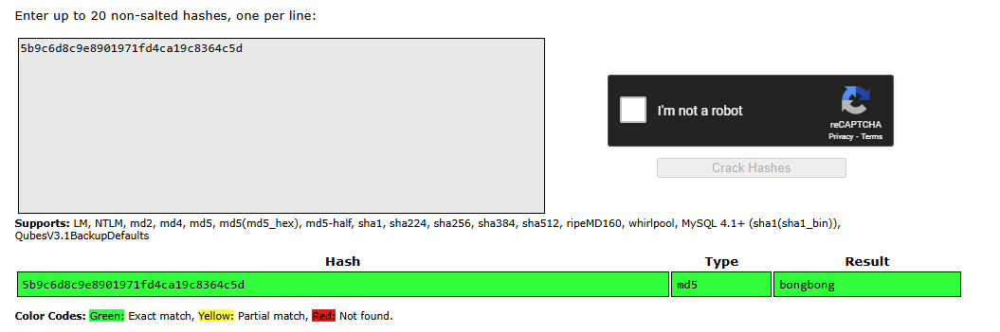

# lukshBoeingImagePracticeWriteup

This is the writeup for the Cyber Patriot practice image that you can access [here on google drive](https://drive.google.com/file/d/1j_f3m6KezvvLMhCdUWkW0h_tRAZ-sRtt/view).
Image creator: Luksh
Image: Ubtuntu (Boeing practice)
Difficulty: Easy

Below is the entire tutorial/writeup to complete this image. Try not to use this writeup unless you are entirely stuck (nothing should take more than 10+ minutes per forensic).

# Unlocking the image


When the image is initially loaded, it will be in a locked state. This is done on purpose and can easily be unlocked via attempting to enter anything in the password line.

`boingisnointern` _is_ the **password**. Use that to log into the system.

# Forensics

The entire system is a bunch of forensics.

## Challenge #1

```
What is the full path of the file that allowed you to see the password when you tried logging into this system?
---------------------------------------------------------------------------------------------------------------------------------

ANSWER:
```

To find the file we can look online for how this would work.
According to this [post](https://superuser.com/a/150706/1777974):

> **THe policy is found in /etc/pam.d/common-password**. Default policy is obscure which is documented in the pam_unix man page. You may want to install pam_cracklib and add some addition policies. Password changes by root generally avoid policies.

By going into /etc/pam.d/common-password we find the line:

```
auth	[success=1 default=ignore]	pam_exec.so boingisnointern
```

Hence, we can assume that this is the file.

Answer: `/etc/pam.d/common-password`

## Challenge #2

```
We have recieved intel of a boeing whistleblower's name. We have gotten this information via something called an md5. Nobody here knows what it is, but we must figure it out. This is what we got: 5b9c6d8c9e8901971fd4ca19c8364c5d
---------------------------------------------------------------------------------------------------------------------------------

ANSWER:
```

We can easily put this into a hash cracker online. https://crackstation.net/ works perfectly.


Answer: `bongbong`

## Challenge #3

## Challenge #4

## Challenge #5

## Challenge #6

## Challenge #7

## Challenge #8
